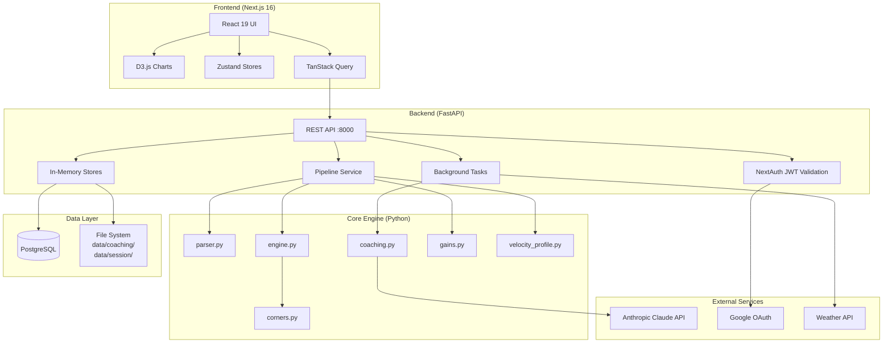
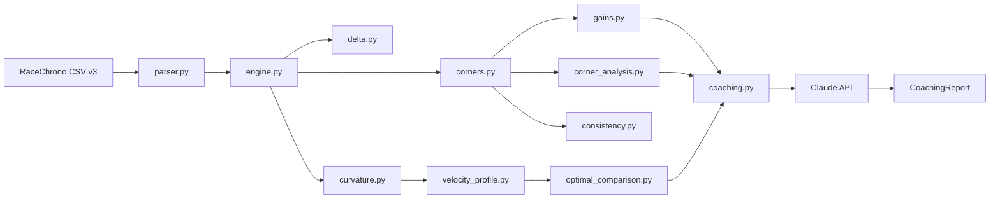
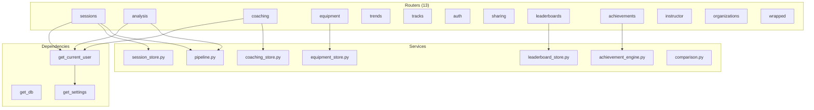
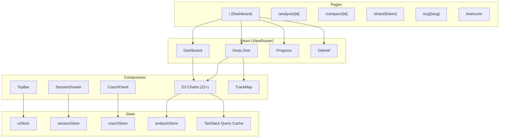
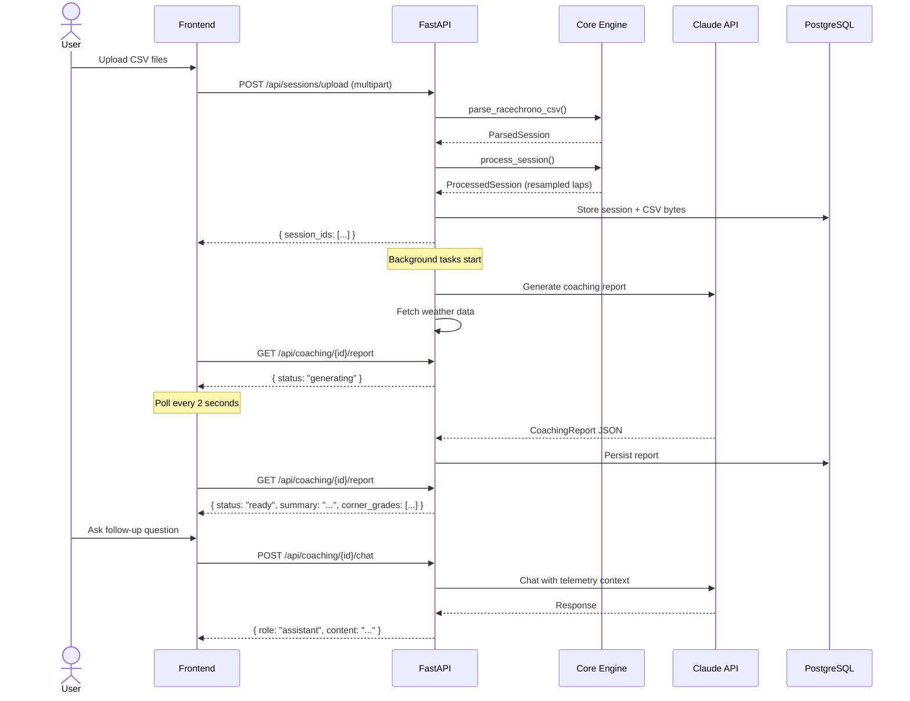
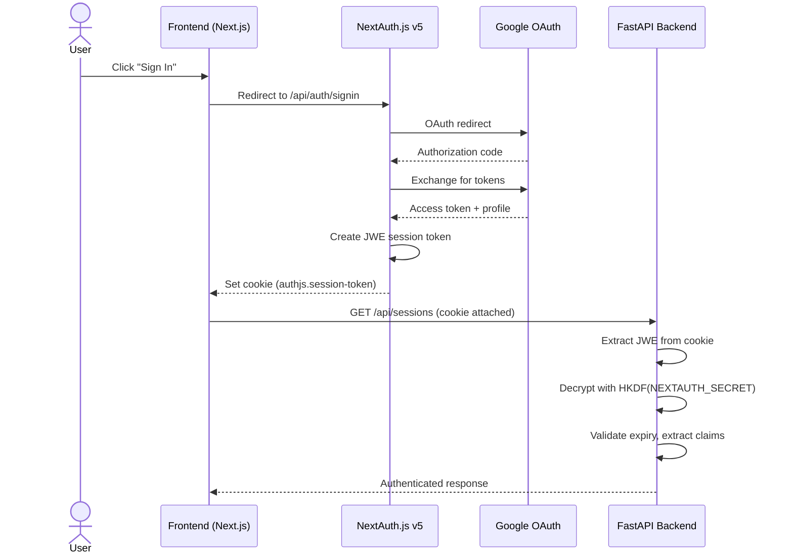
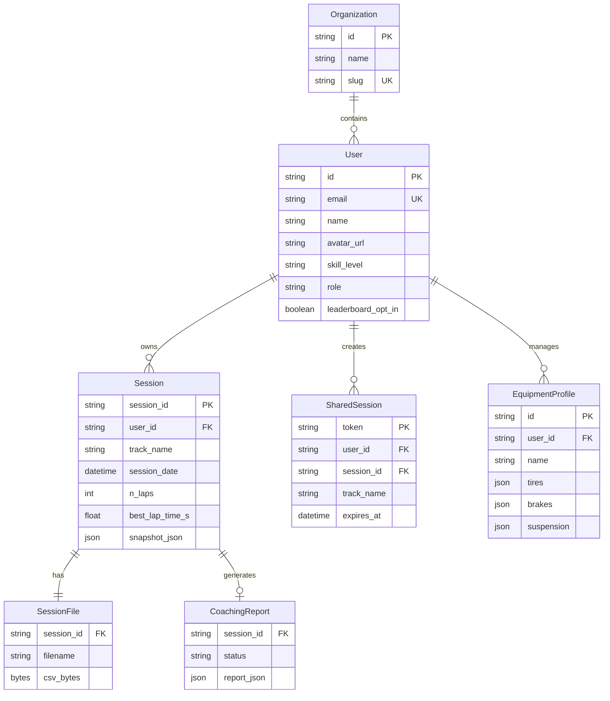

# System Architecture

## Overview

Cataclysm is a three-tier application: a Python core engine for telemetry processing, a FastAPI backend serving REST APIs, and a Next.js frontend for visualization and interaction.



## Component Architecture

### Core Engine (`cataclysm/`)

The core engine is a pure Python library with no web framework dependencies. All processing converts time-domain GPS telemetry into **distance-domain** data, resampled at 0.7m intervals to match 25Hz GPS resolution.



**Key design decisions:**
- **Distance domain**: All lap data resampled to 0.7m steps (not time-based). This makes corner detection deterministic and lap comparison straightforward.
- **Dataclass-centric**: All structured data uses Python `dataclasses`, not dicts. This enables type checking with mypy.
- **Stateless modules**: Each module accepts structured input and returns structured output. No shared mutable state.

### Backend API (`backend/`)

FastAPI application serving REST endpoints with async PostgreSQL via SQLAlchemy.



**Key patterns:**
- **Dependency injection**: `get_current_user()` validates JWT tokens from NextAuth.js v5.
- **Background tasks**: Coaching reports and weather data are fetched asynchronously after upload.
- **Dual storage**: In-memory session store (fast) + PostgreSQL (persistent). Sessions loaded from DB on startup.
- **Response models**: Pydantic schemas for all endpoints, with automatic OpenAPI generation.

### Frontend (`frontend/`)

Next.js 16 App Router with React 19, using Zustand for UI state and TanStack Query for API caching.



**Key patterns:**
- **SPA after auth**: All analysis happens on `/` with `ViewRouter` switching between 4 views.
- **Cursor sync**: `cursorDistance` in `analysisStore` synchronizes crosshair across all charts.
- **Lazy data loading**: TanStack Query fetches data on demand with 60s stale time.
- **Error boundaries**: `ViewErrorBoundary` and `ChartErrorBoundary` prevent cascading failures.

## Data Flow: CSV Upload to Coaching Report



## Authentication Flow



## Database Schema



## Directory Structure

```
cataclysm/
├── cataclysm/                  # Core Python engine (35+ modules)
│   ├── parser.py               # RaceChrono CSV parsing
│   ├── engine.py               # Distance-domain resampling
│   ├── corners.py              # Corner detection & KPIs
│   ├── coaching.py             # Claude API integration
│   ├── gains.py                # Time-gain estimation
│   ├── consistency.py          # Session consistency metrics
│   ├── velocity_profile.py     # Physics-optimal speed solver
│   ├── track_db.py             # Known track database
│   └── ...
├── backend/                    # FastAPI backend
│   ├── api/
│   │   ├── main.py             # App entry point
│   │   ├── config.py           # Settings (Pydantic)
│   │   ├── dependencies.py     # DI (auth, DB, settings)
│   │   ├── routers/            # 13 API routers
│   │   ├── services/           # Business logic
│   │   ├── schemas/            # Pydantic models
│   │   └── db/                 # SQLAlchemy + Alembic
│   └── tests/                  # Backend tests (18 files)
├── frontend/                   # Next.js 16 frontend
│   ├── src/
│   │   ├── app/                # Pages (App Router)
│   │   ├── components/         # React components
│   │   ├── stores/             # Zustand stores
│   │   ├── hooks/              # Custom hooks
│   │   └── lib/                # API client, types, utils
│   └── package.json
├── tests/                      # Core engine tests (40 files)
├── data/                       # Runtime data (coaching, sessions)
├── docs/                       # Documentation
├── docker-compose.yml          # Local development
├── Dockerfile.backend          # Backend container
├── Dockerfile.frontend         # Frontend container
└── pyproject.toml              # Python project config
```
